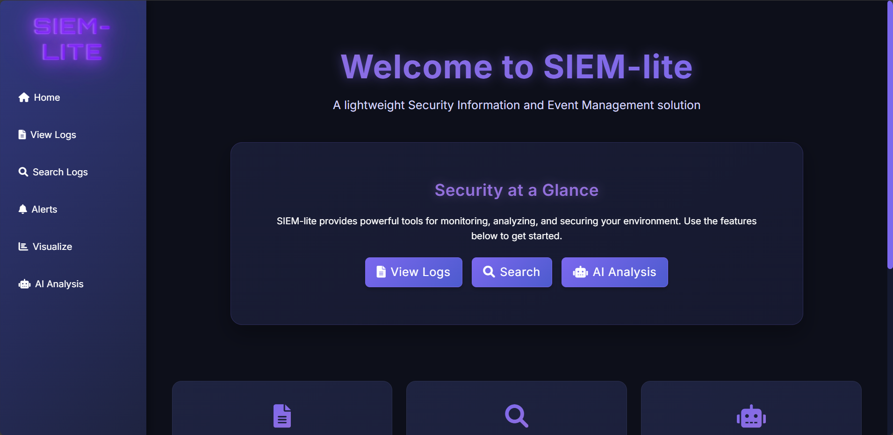

# SIEM-lite

SIEM-lite is a lightweight Security Information and Event Management solution designed for monitoring, analyzing, and securing your environment through powerful log management and AI-driven analysis capabilities.



## 🚀 Features

- **Log Management**: View and browse logs from multiple sources
- **Advanced Search**: Query logs using powerful filters and regular expressions
- **AI-Powered Analysis**: Leverage Google's Gemini AI to analyze logs and detect threats
- **Visualization**: View statistics and trends through interactive charts
- **Alert Management**: Get notified of suspicious activities detected through AI analysis
- **Multi-platform Support**: Handle logs from both Windows and Linux environments

## 🛠️ Technology Stack

### Backend
- **Python 3.8+**: Core programming language
- **Flask**: Web framework for the application
- **ELK Stack**:
  - **Elasticsearch**: For storing and indexing log data
  - **Logstash**: For log ingestion and transformation

### Frontend
- **HTML5/CSS3**: Structure and styling
- **Bootstrap 5**: UI framework for responsive design
- **JavaScript**: Client-side interactivity
- **Chart.js**: Interactive data visualization
- **Particles.js**: Background animation effects

### AI & Machine Learning
- **Google Gemini AI**: For intelligent log analysis and threat detection

### DevOps & Deployment
- **Docker**: Containerization
- **Docker Compose**: Multi-container application orchestration

## 📋 Prerequisites

- Docker and Docker Compose
- Python 3.8 or higher
- Google Gemini API key

## 🔧 Installation & Setup

### 1. Clone the repository

```bash
git clone https://github.com/yourusername/SIEM-lite.git
cd SIEM-lite
```

### 2. Configure Google Gemini API

Get your API key from https://aistudio.google.com/app/apikey and set it as an environment variable:

```bash
# Linux/macOS
export GEMINI_API_KEY="your_api_key_here"

# Windows (CMD)
set GEMINI_API_KEY=your_api_key_here

# Windows (PowerShell)
$env:GEMINI_API_KEY="your_api_key_here"
```

### 3. Start the ELK Stack with Docker Compose

```bash
docker-compose up -d
```

This will start Elasticsearch and Logstash containers. Elasticsearch will be accessible at http://localhost:9200.

### 4. Install Python dependencies

```bash
pip install -r requirements.txt
```

### 5. Start the Flask application

```bash
cd web
python app.py
```

The web interface will be available at http://localhost:5000.

## 🔍 Using SIEM-lite

### Log Management

1. Navigate to "View Logs" in the sidebar
2. Select a log file from the dropdown
3. View parsed log entries with timestamps and severity levels

### Search Logs

1. Navigate to "Search Logs" in the sidebar
2. Enter search terms, specify fields, and set filters
3. View matching results from Elasticsearch

### AI Analysis

1. Navigate to "AI Analysis" in the sidebar
2. Upload or select log files
3. Choose specific log entries or analyze entire files
4. View AI-generated insights and threat assessments

### Alerts

Alerts are automatically generated when the AI detects suspicious patterns. View all alerts in the "Alerts" section.

### Visualization

The "Visualize" section provides statistical insights with charts showing log volumes, alert trends, and more.

## 📊 Log Data Structure

SIEM-lite supports various log formats:

- Windows log files (.log, .csv)
- Linux log files (.log, .csv)

The system automatically parses common fields like:
- Timestamp
- Level/Severity
- Component
- Content
- Event ID
- Event Template

## 🔎 Querying Elasticsearch

### Simple Query via Browser

```
http://localhost:9200/loghub-logs-*/_search?q=field_name:phrase&size=number_of_results&pretty
```

### Advanced Query with cURL (Linux/macOS)

```bash
curl -X GET "http://localhost:9200/loghub-logs-*/_search?pretty" -H 'Content-Type: application/json' -d'
{
  "query": {
    "match_phrase": {
      "Content": "search_term"
    }
  }
}'
```

### Windows CMD Query Example

```bash
curl -X GET "http://localhost:9200/loghub-logs-*/_search?pretty" -H "Content-Type: application/json" -d "{\"query\": {\"match_phrase\": {\"Content\": \"ftpd\"}}}"
```

## 🛡️ Security Considerations

- The current setup does not include authentication for the web interface
- For production use, consider enabling Elasticsearch security features
- API keys should be properly secured and not committed to version control

## 🔄 Updating

To update SIEM-lite to the latest version:

```bash
git pull
docker-compose down
docker-compose up -d
```

## 🐞 Troubleshooting

### Elasticsearch not starting
```
# Check logs
docker logs elasticsearch

# Increase virtual memory limits on Linux
sudo sysctl -w vm.max_map_count=262144
```

### Logstash not processing logs
```
# Check logs
docker logs logstash

# Verify path mappings in docker-compose.yml
```

### AI analysis not working
- Verify that your GEMINI_API_KEY is correctly set
- Check internet connectivity to Google's API services

## 🤝 Contributing

Contributions are welcome! Please feel free to submit a Pull Request.

1. Fork the repository
2. Create your feature branch (`git checkout -b feature/amazing-feature`)
3. Commit your changes (`git commit -m 'Add some amazing feature'`)
4. Push to the branch (`git push origin feature/amazing-feature`)
5. Open a Pull Request

## 📜 License

This project is licensed under the MIT License - see the LICENSE file for details.

## 📚 Additional Resources

- [Elasticsearch Documentation](https://www.elastic.co/guide/en/elasticsearch/reference/current/index.html)
- [Logstash Documentation](https://www.elastic.co/guide/en/logstash/current/index.html)
- [Flask Documentation](https://flask.palletsprojects.com/)
- [Google Gemini AI Documentation](https://ai.google.dev/docs)
